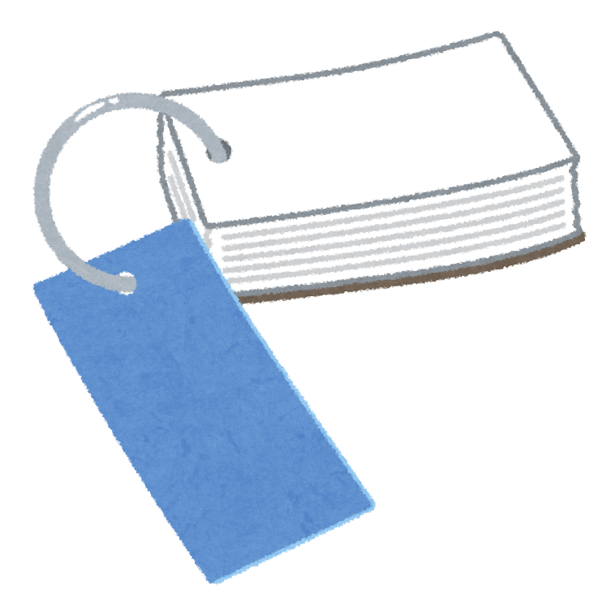
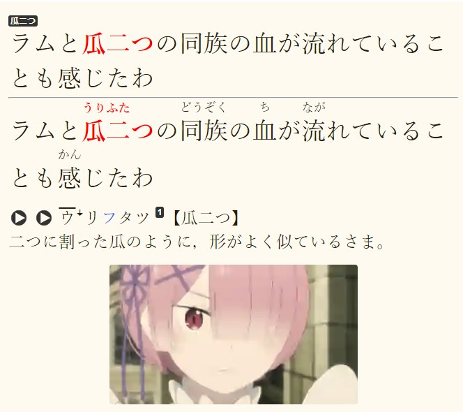
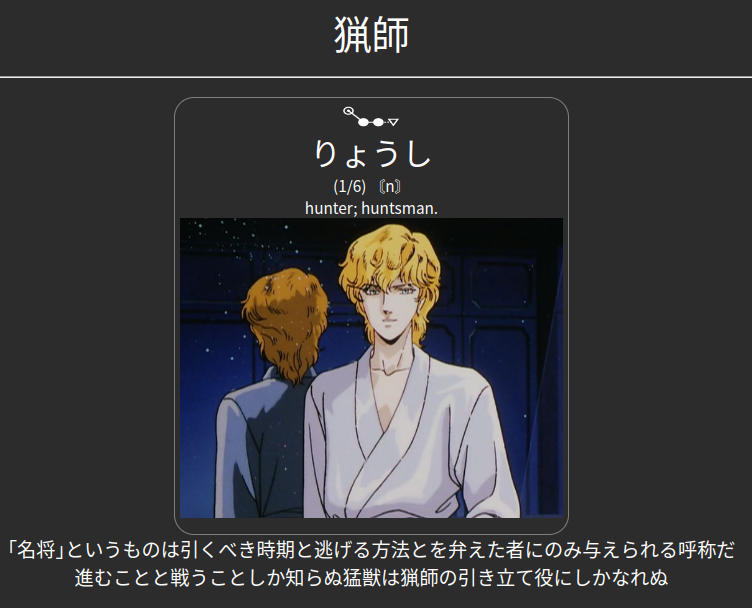
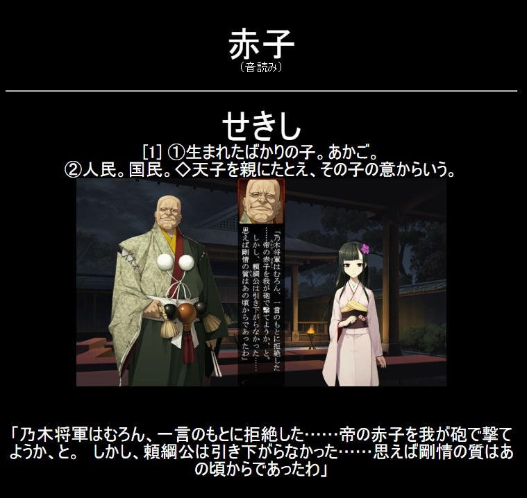
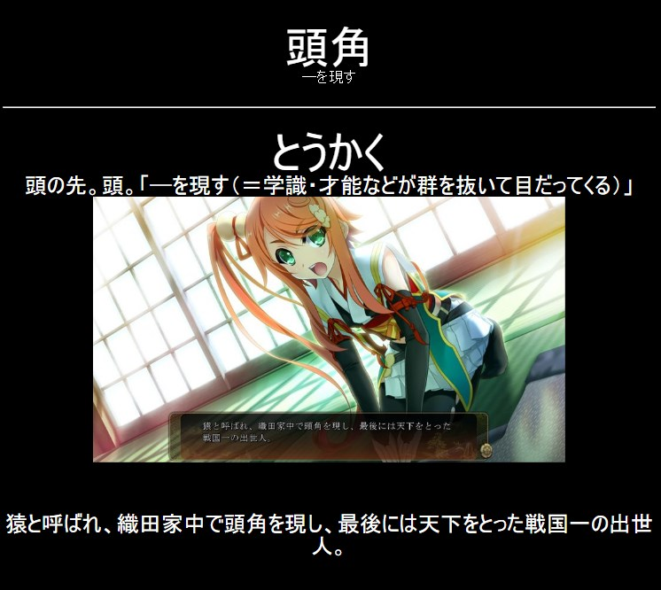
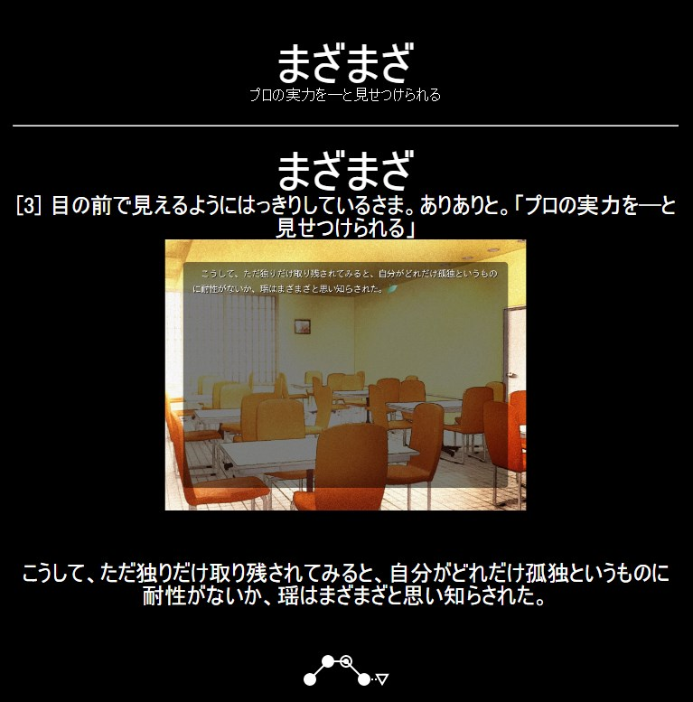

# Discussing the different Anki card types

Although most people agree that using Anki is beneficial to learning Japanese, they often disagree on what the best card
type is. There are a large amount of options and getting a clear idea can be confusing. Most card types however are
either useless or only useful in highly specifics contexts (audio cards, cloze cards, simple word cards without
context). Those will not be covered here and you should avoid them outside of decks made for specific purposes where
they make sense. Instead the focus will be on what should be the bulk of your review load and the kind of cards you will
create during your consumption of Japanese media (mining), **recognition cards**. The two major card formats popular in
the community for this purpose are sentence cards and anime cards (word context cards). Both will get a short
introduction here, after which I will list arguments for why I think the latter is the preferred option.

Note that this section only discusses formats, not card creation (which is covered later).

<figure>
  
</figure>

---

## Sentence Cards

A sentence card contains the following information:

- Context/sentence on the front where target word is used
- Reading(s) on the back
- Japanese or English definition for the target word on the back

Optimally it also contains:

- Word and sentence audio
- Visual context information
- Pitch accent information

<figure>
  
<figcaption>An example sentence card.</figcaption>
</figure>

You read the sentence on the front and decide whether you understood it and were able to read it correctly. Although not
a bad option and very popular in the community they suffer from a number of weaknesses.

---

## Anime Cards/Word Context Cards

An anime card contains similar information but arranged differently. It has to contain:

- The target word on the front
- The reading of the target word on the back
- Japanese or English definition for the target word on the back
- Word audio on the back
- Context/sentence on the back

Optimally it also contains:

- Sentence audio
- Visual context information (screenshot)
- Pitch accent information

Depending on the situation it may contain:

- A hint field on the front (more on this later)

<figure>
  
<figcaption>An example anime card (made from an anime).</figcaption>
</figure>

Reviewing these cards is very simple. You look at the information on the front (the word and sometimes a hint) and
decide whether you knew the meaning and the reading. If you did you pass the card. If you didn't you use all the
information on the back of the card to remind yourself of the meaning, context and usage and fail it. You can get a
sample deck with this card format here: <https://ankiweb.net/shared/info/151553357>

---

## Sentence Cards vs Anime Cards

Anime cards are the better option for a large number of reasons.

### 1. Review time

As you do not have to read the entire sentence for every single card you can review anime cards much faster. This means
you can invest more time into either doing more cards or consuming more Japanese content.

The conclusion I have reached after reviewing various peoples review data that used both card formats is that review
speed is 2 to 4 times as fast. This is extremely important. Most people do not enjoy doing Anki due to the massive time
investment it is and the mental drain investing that time is to them. By saving that time they not only gain back time
they can invest elsewhere, their motivation to invest it more valuably is also much higher.

### 2. Sentence cards are too easy

Reviewing words in a context you are already familiar with is problematic and is not representative of situations where
you will have to recall the target word later. Before you have even reached the relevant section of the sentence, you
will already have recalled the situation, and it will be impossible to fail the card based on 'meaning' because of how
strong context memory is. This is doubly true if you put the image on the front of the card.

However, you have no guarantee you actually remembered the information you made a card for in the first place. Anime
cards fix this by stripping the context from the front of the card and merely using it to remind you of what the word
means if you fail it and need to be reminded.

### 3. Sentence cards are too complicated

They simply test too much. Rather than testing you on a minimal piece of information (reading and meaning of one word)
you will have to read an entire sentence, decide whether you were able to read every word, understood the sentence as a
whole and knew what the parts meant. Do this hundreds of times a day, and you will indeed experience 'decision fatigue'.

Anime cards are more simple testing you on far fewer information making the review process and decision-making simple.
Your brain is equipped with everything it needs to recognize most things out of context and where there might be
difficulties we add a hint field (see below).

### 4. *"What about all the people that did learn Japanese through sentence cards?"*

It's not that they don't work, but you can do a lot better. Let me borrow a formulation used by the same crowd of people
that claim sentence cards work when they talk about people who were 'successful' through traditional study methods:

**They learned despite it, not because of it.** Most of these people have dedicated large parts of their lives to the
pursuit of Japanese language skills, only a small part of which has anything to do with cards, and we shouldn't make the
mistake of thinking Anki is anything but complementary to the other activities that you engage in with the language. Not
to mention that there is no information about how many people **failed** learning Japanese using sentence cards,
see [Survivorship bias](https://en.wikipedia.org/wiki/Survivorship_bias).

### 5. "*By reviewing sentences you will build internal grammar and remember word usages useful in your output.*"

I think this ideas is problematic for several reasons. This was already discussed, but think about how flashcards work:
You are recalling information on the back of the cards in response to information on the front of the card. Or in other
words: **You are not memorizing the sentence.**

In that case we have to ask ourselves what 'input' process is supposed to take place during Anki reviews that does not
take place during reading and listening. The answer is none and that you are better served doing more of exactly that.

And in the first place, would we take the idea that we need Anki to memorize expressions to the logical end, we would
reach the conclusion that we have to make a card for every single word usage and every single collocation. That is not a
feasible task and not something anyone has ever done before, so the initial preposition is unlikely to be true.

---

## The 'hint' field.

Although covered in detail on the [sample deck page](https://ankiweb.net/shared/info/151553357), I'm going to cover
the 'hint' field for anime cards here as well for completion.

### Disambiguating readings.

You can use the hint field to disambiguate the correct reading. Sometimes this is cleared up by the context, but often it
isn't and has to be explicitly mentioned. A couple of examples:

- 武士 (ぶし - もののふ)
- 海風 (かいふう - うみかぜ)
- 赤子 (せきし - あかご)
- 耳朶 (じだ - みみたぶ)
- 足跡 (そくせき - あしあと)
- 悪口 (あっこう - わるくち)

Of course there are thousands of additional examples.

<figure>
  
<figcaption>Using the hint field to disambiguate reading.</figcaption>
</figure>

### Words appearing only in certain contexts.

Some words will only appear in certain expressions. As this context will be identical to the majority of the times you
will see the word, it is fine to include it as a hint.

As for the reason why you wouldn't mine the entire expression in the first place: they might not have entries in
Japanese to Japanese dictionaries and may not be voiced in the Yomitan audio.

<figure>
  
<figcaption>Using the hint field to detail words appearing in certain expressions.</figcaption>
</figure>

### Onomatopoeic or kana words.

Kanji provide a semantic hint towards the meaning of the word. If this hint is missing entirely it may be much harder to
remember the meaning without a context. To make these cards easier on you, it does make sense to include a context
snipped for clarification:

<figure>
  
<figcaption>Using the hint field to disambiguate kana words.</figcaption>
</figure>

### Making cards easier.

When the kanji don't provide enough of a hint, or you have failed a card several time you can use the hint field to
straight up make the review process easier. It should generally be avoided where you can but can be used as a last
resort. 