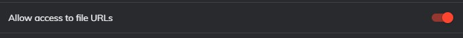
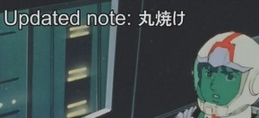

# Mining from Anime

I would like to introduce two methods of mining from Anime here. You can find subtitles
on [kitsunekko](https://kitsunekko.net/dirlist.php?dir=subtitles%2Fjapanese%2F) and if you want to know how to sync them
check out the [resync section](subtitles.md).

---

## Anacreon mpv Script

This is a really fast and recent method to mine from anime. Making use of mpv scripting capabilities the script (made by
Anacreon from the DJT thread; check out his site <a href="https://anacreondjt.gitlab.io/">here</a>) captures the entire
context in the form of sentence, audio and screenshot and adds it to your Anki cards fully automatically. Here is a
video demonstration:

<iframe width="560" height="315" src="https://www.youtube.com/embed/M4t7HYS73ZQ" frameborder="0" allow="accelerometer; autoplay; clipboard-write; encrypted-media; gyroscope; picture-in-picture" allowfullscreen></iframe>

---

### New video tutorial by Anacreon

<iframe width="560" height="315" src="https://www.youtube.com/embed/wSexzzsJSqA" frameborder="0" allow="accelerometer; autoplay; clipboard-write; encrypted-media; gyroscope; picture-in-picture" allowfullscreen></iframe>

---

### Requirements

1. A [mining deck set up with Yomitan](yomichansetup.md) (you can find a template deck you can
   use [here](https://ankiweb.net/shared/info/151553357)).
2. The mpv player. <p>mpv ([get it here if you are on Windows](https://mpv.io/)) is a free video player with great scripting capabilities.</p>
3. The script itself. The newest version can always be found
   here: <https://mega.nz/folder/349ziIYT#gtEzi4UtnyDVr4_wJAvBlg>
4. A <a href="https://anacreondjt.gitlab.io/docs/texthooker/">text hooking page</a> (preferably download it for local
   access) and clipboard
   watcher ([Chrome](https://chrome.google.com/webstore/detail/clipboard-inserter/deahejllghicakhplliloeheabddjajm)
   or [Firefox](https://addons.mozilla.org/ja/firefox/addon/clipboard-inserter/)) (also useful for visual novels).
5. **(Linux users only)** Make sure xclip and curl are installed.

Ensure Yomitan (and the clipboard plugin too) have access to file URLs otherwise Yomitan can't capture text from the
text hooking page.
<figure>
  
  <figcaption>Accessible through the 'Manage extensions' options menu.</figcaption>
</figure>


---

### Installation

1. After installing mpv move the script to the mpv script folder. On Windows usually
   at: `C:/Users/Username/AppData/Roaming/mpv/scripts/` (If it doesn't exist create it.) <p>You can reach the appdata
   folder by simply typing `%appdata%` into the address bar or the search.</p> The path is `~/.config/mpv/scripts/` on
   Linux.
2. Open the script in a text editor and adjust the values to fit your mining deck.

If you are using the template deck above and didn't edit the fields you can copy this to get the correct field
information:

```
------------- User Config -------------
-- Set these to match your field names in Anki
local FRONT_FIELD = "Word"
local SENTENCE_AUDIO_FIELD = "SentenceAudio"
local SENTENCE_FIELD = "Sentence"
local IMAGE_FIELD = "Picture"
```

**Important:**

- Don't forget to adjust the path information (`[[Anki2\User 1\collection.media]]`) so it matches your Anki username
  and links to a valid media folder. The script will not work if this folder is not correctly set.
- You need to have **separate fields for word audio and sentence audio** in the script settings and on your card format.

**For MacOS users:**
Use jpeg instead of webp in your IMAGE_FORMAT setting and brew install the latest version of MPV.

**Windows 7 users:**
Update to the latest version of PowerShell for proper clipboard insertion.

Set your preferred options for the other settings as well. I like to confirm the audio is correct after capture so I
would set `local AUTOPLAY_AUDIO = true` but that is mere preference.

---

### Usage

1. Open the clipboard page and activate the clipboard inserter plugin by clicking on it. <p>It is advised to use the
   html page linked above (or <a href="/assets/hZ4sawL4.html" download>here</a>) as other pages may add symbols that
   break the script on certain browsers.</p>
2. Open your anime with mpv and Japanese subtitle. <p>The subtitles will appear on the html page and you can scan them
   with Yomitan.
   <video controls>
    <source src="video/clipboardmpv.mp4" type="video/mp4">
    Your browser does not support the video tag.
    </video>
3. When there is a word you want to mine, [create a card with Yomitan](yomichansetup.md).
4. Select the entire sentence/section you want to have as context on your card and copy it.
5. Go back into the mpv window and press Ctrl + v <p>A notification should appear saying that the card got updated. The
   card should now be updated.

<figure>
  
</figure>

---

### Troubleshooting

If something did not work try these things:

- Ensure both the fields and the path is correctly set.
- Try updating mpv if you are using an older version.
- Cards can't be updated while selected in the card browser. Exit the card browser and try again.

- If the script is lagging on Windows: This is a powershell issue (
  see [here](https://www.reddit.com/r/PowerShell/comments/6a6gnd/powershell_console_is_slow_to_start/)). To solve this
  run the following in an admin powershell:

```
Set-Alias ngen (Join-Path ([Runtime.InteropServices.RuntimeEnvironment]::GetRuntimeDirectory()) ngen.exe)
ngen update
```

---

## Animebook

[Animebook](https://github.com/animebook/animebook.github.io) is a web video player that displays subtitles next to the
video played. The advantage is that you can look up the subtitles directly on the video with Yomitan and that they are
displayed next to the video so you don't have to alt tab, but less video formats are supported (although this shouldn't
be a problem if you are using a Chromium build with extended codecs).

<figure>
  
</figure>

- For a full overview of video compatibility see
  here: <https://github.com/animebook/animebook.github.io#video-format-support>
- If you don't have Yomitan setup yet with a mined card format see the [Yomitan setup section](yomichansetup.md).

---

### Usage with Animebook extension

The official Chrome extension provides additional features to Animebooks not covered by this page. If you prefer this
option check out
the [extension page](https://chrome.google.com/webstore/detail/animebook-anki-export/ohcbgkombhgcbjcikjlgdmjkpibafppa).

### Usage without Animebook extension

1. Mine a word using Yomitan
2. Copy the sentence and paste it into the sentence field
3. Use the sidebar and click on where you would like to start capturing the audio from
4. Record the audio using ShareX (or equivalent) and paste it into the audio field
5. Take a screenshot with ShareX (or equivalent) and paste it into the screenshot field