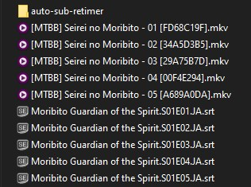
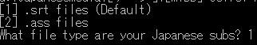
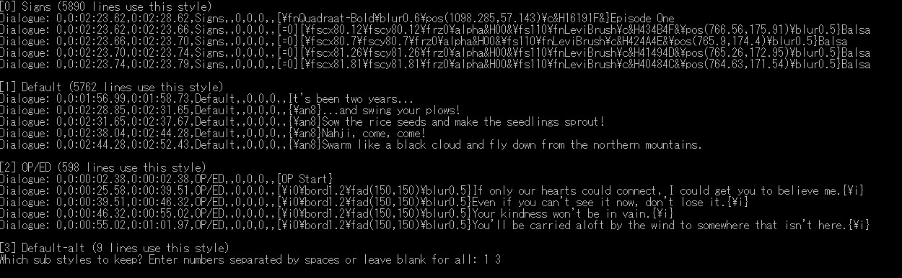
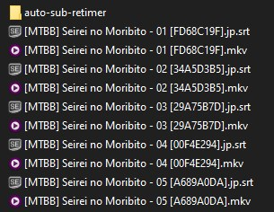

# Resync subtitles

Subtitles can be found on [kitsunekko](https://kitsunekko.net/dirlist.php?dir=subtitles%2Fjapanese%2F) and on the [itazuraneko site](https://itazuraneko.neocities.org/). Sadly, a lot of the time the subtitles you find online and your local video files are not in sync. 

## Automatic resyncing with Alass script

The easiest way to re-time all subtitles with a high amount of accuracy is to use [alass](https://github.com/kaegi/alass). It can account for unexpected splits like commercial breaks and syncs with a very high amount of precision. Alass on it's own however is not very easy to use. Thanks to another script made by Anacreon from the DJT thread, we can very simply re-time downloaded subtitles to our local files utilizing alass. 

A video demonstration:

<iframe width="560" height="315" src="https://www.youtube.com/embed/x0h3ooBHrpk" frameborder="0" allow="accelerometer; autoplay; clipboard-write; encrypted-media; gyroscope; picture-in-picture" allowfullscreen></iframe>

--- 

### Installation and usage

1. Download .zip containing the script and all dependencies. The newest version can always be found here: 
<https://mega.nz/folder/W19xUQJT#Ele4MKy-c61AOp2ZaN5AYg>
 
2. Extract the containing folder and move it to where your video and subtitle files are located. 
Tip: You can move folders around without any writing happening on your drive, if you right-click and use 'cut' instead of copying.
 
You folder structure should look like this: 

3. Run the RUN_ME.bat inside the folder.
4. You will have to select a number of options. You do so by typing the number of the option and pressing enter:
   
	

 

- Most subtitle files on kitsunekko are in the .srt format.
- You should generally re-time using embedded subs as it is vastly more reliable. This also means that you should download shows with English subtitles in them and not 'raws'. 
- Split penalty can be left unchanged most of the time. Only try changing it if a previous sync attempt failed.

The script will now extract all the reference subtitles from the video files. After it is finished, you will be presented with an option menu showing you all 'styles' present in the reference subtitles:

These styles are used by subtitle creators to mark different kinds of subtitles for different types of content. 'Signs' are for example used to translate written text visible on the screen. 'OP/ED' refers to subtitles for the opening and the ending. All these additional subtitles have the potential to interfere with the syncing process as they not present in our Japanese subtitle. We therefore only select the subtitles we want to be considered during the syncing process. In this case [1]Default and [3]Default-alt.

After finishing the syncing process we have a batch of correctly timed and renamed subtitles:
