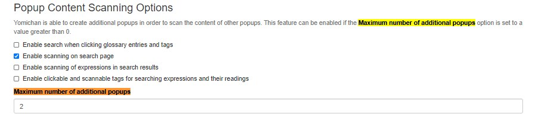

# Setting up Yomitan

**Disclaimer: [Yomichan](https://foosoft.net/projects/yomichan/) is no longer maintained. [Yomitan](https://github.com/themoeway/yomitan) is a fork that fixes bugs and enables Manifest V3 compatibility, which will make Yomichan unusable on Chrome. It is recommended to switch to Yomitan.**

Yomitan is a browser extension that functions as a pop-up dictionary and allows you to create Anki flashcards. Creating flashcards from Japanese content is often referred to as "mining." Yomitan is highly customizable and supports various Japanese dictionaries.

Before proceeding, ensure that both Anki and your browser are using a [Japanese font](https://learnjapanese.moe/font/) instead of a Chinese one.

<figure>
  
</figure>

---

## Install Yomitan

Chrome: [Chrome Web Store](https://chromewebstore.google.com/detail/likgccmbimhjbgkjambclfkhldnlhbnn)

Firefox: [Firefox Add-ons](https://addons.mozilla.org/en-US/firefox/addon/yomitan/)

After installation, you may want to disable the 'Show usage guide on startup' option once you're familiar with the basic functionality.

---

## Install AnkiConnect

AnkiConnect: [AnkiWeb](https://ankiweb.net/shared/info/2055492159)

Yomitan requires the AnkiConnect plugin to interact with Anki.

In Anki, go to Tools → Add-ons → Get Add-ons and enter the code `2055492159`. Restart Anki after installation.

---

## Install Dictionaries for Yomitan

Yomitan supports various dictionaries. Note that Yomitan .zip dictionary files are imported as is and do not need to be extracted.
You can find a large collection [here](https://github.com/MarvNC/yomitan-dictionaries). Consider starting with these:

-   Jitendex (for English definitions)
-   KANJIDIC (for invidiual Kanji)
-   BCCWJ and JPDB frequency dictionaries

Which are all importable through Yomitans `Get recommended dictionaries…` option.

<figure>
  
  <figcaption>Get recommended dictionaries...</figcaption>
</figure>

Additionally install the following dictionary for pitch accent information:

-   [Daijisen (Pitch)](https://drive.google.com/file/d/13NvR5uQ1zAIpvAcSee0bEEvENILbFGbL/view?usp=drive_link) from [here](https://drive.google.com/drive/folders/1LXMIOoaWASIntlx1w08njNU005lS5lez)

<figure>
  
  <figcaption>Importing a dictionary into Yomitan.</figcaption>
</figure>

---

### Additional Dictionaries (J-J)

Jitendex provides simple translations. For advanced learners, monolingual Japanese dictionaries offer detailed explanations and usage examples.

You can find several Japanese dictionaries [here](https://drive.google.com/drive/folders/1tTdLppnqMfVC5otPlX_cs4ixlIgjv_lH) and [here](https://anacreondjt.gitlab.io/docs/dicts/), including those mentioned below. Also, check out the [TMW resources page](https://learnjapanese.moe/resources/) for more dictionaries and resources.

Recommended dictionaries:

J-E:

-   [新和英 Shinwaei](https://drive.google.com/file/d/11zXAthZ2qTe3VNGeuL_R-XLGCsDlXYhP) from [here](https://drive.google.com/drive/folders/1tTdLppnqMfVC5otPlX_cs4ixlIgjv_lH)

J-J (all available [here](https://drive.google.com/drive/folders/1TRylrqtoYi2hW9dAjci5cugNzde_WRTM)):

-   大辞林 Daijirin
-   大辞泉 Daijisen
-   明鏡 Meikyou
-   新明解 Shinmeikai

Daijirin and Daijisen contain extensive and detailed entries, useful for place names and famous people.

Meikyou and Shinmeikai are simpler, making them suitable for learners earlier in their Japanese journey. You can import all of them without interference.

---

### Ordering Dictionaries

You can change the order of dictionaries in the pop-up window in the settings. The top dictionary is used for Anki card creation.

Go to `Configure installed and enabled dictionaries…` and reorder them using the menu buttons.

For advanced learners, prioritize Meikyou for its card entries. Otherwise, use Jitendex.

A possible dictionary order:

<figure>
  
  <figcaption>Example dictionary order.</figcaption>
</figure>

Example popup:

<figure>
  
  <figcaption>Yomitan scan.</figcaption>
</figure>

---

## Additional Settings

Set `Maximum number of child popups` to a value greater than zero to scan words within the Yomitan popup. Enable `Allow scanning popup content` to see this option.

---

## Connect Yomitan and Anki

Enable 'Enable Anki integration'.

Select the deck and model for your mining deck. If you don't have a deck, using [my fork of lapis](https://github.com/friedrich-de/lapis-modified).
If you prefer the layout of the [original lapis deck](https://github.com/donkuri/lapis), you can also use that.

If using the template, go to `Configure Anki card format...` and fill the fields according to the table below.

| Field                 | Value                                                                                                                                                      |
| --------------------- | ---------------------------------------------------------------------------------------------------------------------------------------------------------- |
| Expression            | `{expression}`                                                                                                                                             |
| ExpressionFurigana    | `{furigana-plain}`                                                                                                                                         |
| ExpressionReading     | `{reading}`                                                                                                                                                |
| ExpressionAudio       | `{audio}`                                                                                                                                                  |
| SelectionText         | `{popup-selection-text}`                                                                                                                                   |
| MainDefinition        | Something like `{single-glossary-jmdict/jitendex}`. Find this by clicking the down arrow next to this field, and finding a dictionary in a similar format. |
| Sentence              | `{cloze-prefix}<b>{cloze-body}</b>{cloze-suffix}`                                                                                                          |
| SentenceFurigana      |                                                                                                                                                            |
| SentenceAudio         |                                                                                                                                                            |
| Picture               |                                                                                                                                                            |
| Glossary              | `{glossary}`                                                                                                                                               |
| Hint                  | To understand the usage of this field, refer to [this](ankicards.md)                                                                                 |
| IsWordAndSentenceCard |                                                                                                                                                            |
| IsClickCard           |                                                                                                                                                            |
| IsSentenceCard        |                                                                                                                                                            |
| PitchPosition         | `{pitch-accent-positions}`                                                                                                                                 |
| PitchCategories       | `{pitch-accent-categories}`                                                                                                                                |
| Frequency             | `{frequencies}`                                                                                                                                            |
| FreqSort              | `{frequency-harmonic-rank}`                                                                                                                                |
| MiscInfo              | `{document-title}` If you want your cards to include the title of the tab they were mined from, such as for light novels (LNs), please use this feature.   |

`{selection-text}` is the part of the definition you're highlighting in the popup and will be shown with a higher priority on the card. I recommend always hand-picking the most relevant part of the definition.

---

## Result

You can now create basic word cards by hovering over a word with Yomitan, marking a definition and pressing the + button. Pitch accent information will be included if available.

Result (after adding context information):

